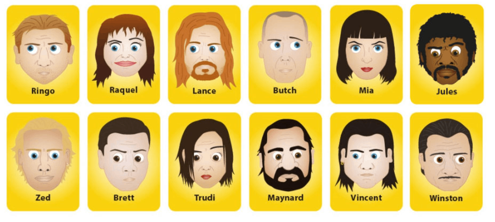

# Laboratory Work 1
> K33401 - Рейнгеверц В.А.


## Task 1
> Binary search
>
> Написать программу для бинарного поиска. 
> Результатом должно быть количество шагов, которое потребуется, чтобы найти требуемое число.
>


[BinarySearch/binarySearch.js](BinarySearch/binarySearch.js)


### Running

```bash
node binarySearch.js <number_to_find>
```


## Task 2
> Guess Who: Pulp Fiction
>
> Для учебной группы составить словарь, который будет описывать характеристики каждого из студентов. 
> Реализовать программу, которая по определенным характеристикам будет угадывать студента.
>
> Пример выполнения:<br>
> 
> \> Студент курит?<br>
> \> Нет.<br>
> \> Студент блондин?<br>
> \> Да.<br>
> \> …<br>
> \> …<br>
> \> Вы загадали Ивана Иванова. <br>

[GuessWho/guessWho.js](GuessWho/guessWho.js)

[GuessWho/guessWho.html](GuessWho/guessWho.html)




Итоговый словарь
```js
export const tree = createNode(
    createYesPredicate("Does your character usually wear lipstic?"),
    createNode(
        createYesPredicate("Does your character have even bangs?"),
        createEndNode("Mia"),
        createNode(
            createYesPredicate("Does your character have blue eyes?"),
            createEndNode("Raquel"),
            createEndNode("Trudi")
        )
    ),
    createNode(
        createYesPredicate("Does your character have a big beard?"),
        createNode(
            createYesPredicate("Is your character ginger?"),
            createEndNode("Lance"),
            createEndNode("Maynard")
        ),
        createNode(
            createYesPredicate("Does your character have black skin?"),
            createEndNode("Jules"),
            createNode(
                createYesPredicate("Is your character bald?"),
                createEndNode("Butch"),
                createNode(
                    createYesPredicate("Does your character have mustache?"),
                    createEndNode("Winston"),
                    createNode(
                        createYesPredicate("Did your character pierce his ear?"),
                        createEndNode("Vincent"),
                        createNode(
                            createYesPredicate("Does your character have green eyes?"),
                            createEndNode("Ringo"),
                            createNode(
                                createYesPredicate("Is your character blonde?"),
                                createEndNode("Zed"),
                                createEndNode("Brett")
                            )
                        )
                    )
                )
            )
        )
    )
);
```


### Running

Use http server to serve [GuessWho/guessWho.html](GuessWho/guessWho.html) file

## Task 3
> Составьте граф для задания №2.
>

[Graphs/main.js](Graphs/main.js)

"Словарь", из предыдущего задания динамически конверируется в nodes и edges (функция [convertToGraphData()](GuessWho/guessWho.js#L98)), затем отрисовывается при помощи библиотеки cytoscape в [Graphs/main.js](Graphs/main.js#L49).


### Running

```bash
npm install
```

```bash
npm run dev
```